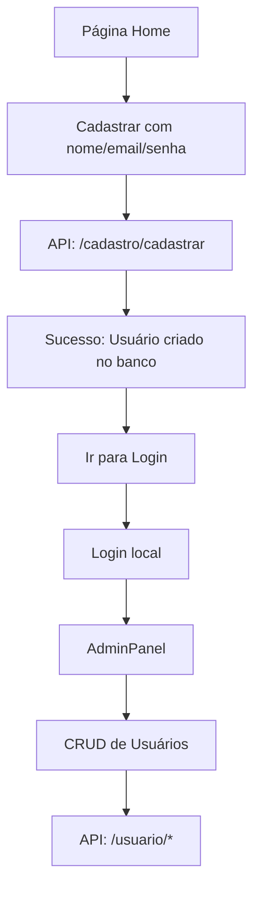

# 🔌 Integração Frontend + Backend

## 📋 Resumo da Implementação

Este projeto React foi integrado com o backend Spring Boot através das seguintes implementações:

### ✅ O que foi implementado

1. **Instalação do Axios** - Biblioteca para requisições HTTP
2. **Services** - Camada de serviços para comunicação com a API
3. **Tipos TypeScript** - Interfaces para os DTOs do backend
4. **Página Home** - Formulário de cadastro inicial
5. **AdminPanel** - CRUD completo de usuários com paginação

---

## 🗂️ Estrutura de Arquivos Criados/Modificados

```
src/
├── services/
│   ├── api.ts              # Configuração do Axios
│   ├── config.ts           # Configurações e URLs da API
│   ├── cadastroService.ts  # Serviço de cadastro
│   ├── usuarioService.ts   # Serviço CRUD de usuários
│   └── README.md           # Documentação dos serviços
├── types/
│   └── index.ts            # ✏️ Atualizado com novos tipos
├── pages/
│   ├── Home.tsx            # ✏️ Integrado com /api/cadastro/cadastrar
│   └── AdminPanel.tsx      # ✏️ Integrado com /api/usuario/*
```

---

## 🔗 Endpoints Integrados

### 1️⃣ Cadastro Inicial (Home)

**Controller**: `CadastroController`

- **POST** `/api/cadastro/cadastrar`
  - Cadastra usuário com nome, email e senha
  - Usado na página inicial (Home)

### 2️⃣ CRUD de Usuários (AdminPanel)

**Controller**: `UsuarioController`

- **POST** `/api/usuario/criar` - Criar usuário
- **GET** `/api/usuario/listar` - Listar com paginação
- **GET** `/api/usuario/{id}` - Buscar por ID
- **PUT** `/api/usuario/{id}` - Atualizar usuário
- **DELETE** `/api/usuario/{id}` - Deletar usuário

---

## 🚀 Como Usar

### 1. Configurar URL do Backend

Edite `src/services/config.ts`:

```typescript
export const API_CONFIG = {
  baseURL: "http://localhost:8080/api", // Altere aqui se necessário
  // ...
};
```

### 2. Iniciar o Backend

Certifique-se de que seu backend Spring Boot está rodando em:

```
http://localhost:8080
```

### 3. Iniciar o Frontend

```bash
npm run dev
```

---

## 📱 Funcionalidades

### Página Home (`/`)

- **Formulário de Cadastro**
  - Nome, email e senha
  - Validação de campos
  - Feedback visual (sucesso/erro)
  - Integração com `/api/cadastro/cadastrar`
  - Link para fazer login após cadastro

### Página Login (`/login`)

- Login local (não integrado com backend ainda)
- Redireciona para AdminPanel após login

### Painel Admin (`/admin`)

- **Listar Usuários**
  - Tabela com todos os usuários
  - Paginação (10 itens por página)
  - Contador de total de usuários
- **Criar Usuário**
  - Modal com formulário
  - Campos: nome, email, telefone
  - Validação de campos obrigatórios
- **Editar Usuário**
  - Modal pré-preenchido
  - Atualiza dados existentes
- **Excluir Usuário**
  - Modal de confirmação
  - Alerta de ação irreversível

---

## 🔄 Fluxo de Uso



---

## 🎨 Recursos Visuais

- ✅ **Loading States** - Spinners durante requisições
- ✅ **Mensagens de Feedback** - Alertas de sucesso/erro
- ✅ **Validação de Formulários** - Campos obrigatórios
- ✅ **Paginação** - Navegação entre páginas
- ✅ **Modal de Confirmação** - Para ações destrutivas
- ✅ **Ícones Bootstrap** - Interface intuitiva
- ✅ **Responsive Design** - Mobile friendly

---

## 🛠️ Tipos TypeScript

### Cadastro

```typescript
interface CadastroRequest {
  nome: string;
  email: string;
  senha: string;
}

interface CadastroResponse {
  id: number;
  nome: string;
  email: string;
  mensagem?: string;
}
```

### Usuário (CRUD)

```typescript
interface UsuarioRequest {
  nome: string;
  email: string;
  telefone?: string;
}

interface UsuarioResponse {
  id: number;
  nome: string;
  email: string;
  telefone?: string;
}
```

### Paginação

```typescript
interface PageResponse<T> {
  content: T[];
  totalElements: number;
  totalPages: number;
  size: number;
  number: number;
  first: boolean;
  last: boolean;
  empty: boolean;
}
```

---

## ⚠️ Tratamento de Erros

- **Interceptor do Axios** captura e loga erros
- **Try/Catch** em todas as chamadas de serviço
- **Mensagens amigáveis** ao usuário
- **Loading states** previnem múltiplos cliques

---

## 🔐 Segurança

> ⚠️ **IMPORTANTE**: Este projeto usa autenticação local (frontend) apenas para demonstração. Para produção, implemente autenticação JWT com o backend.

### Para adicionar autenticação JWT (futuro):

1. O backend retorna um token JWT no login
2. Armazene o token no localStorage
3. Adicione o token no interceptor do Axios:

```typescript
// Em src/services/api.ts
api.interceptors.request.use((config) => {
  const token = localStorage.getItem("token");
  if (token) {
    config.headers.Authorization = `Bearer ${token}`;
  }
  return config;
});
```

---

## 📝 Checklist de Integração

- [x] Axios instalado
- [x] Configuração da API criada
- [x] Services implementados
- [x] Tipos TypeScript definidos
- [x] Home integrada com cadastro
- [x] AdminPanel integrado com CRUD
- [x] Paginação implementada
- [x] Tratamento de erros
- [x] Loading states
- [x] Validação de formulários
- [ ] Autenticação JWT (futuro)

---

## 🐛 Troubleshooting

### Erro de CORS

Se aparecer erro de CORS, adicione no backend (Spring Boot):

```java
@Configuration
public class CorsConfig {
    @Bean
    public WebMvcConfigurer corsConfigurer() {
        return new WebMvcConfigurer() {
            @Override
            public void addCorsMappings(CorsRegistry registry) {
                registry.addMapping("/api/**")
                        .allowedOrigins("http://localhost:5173")
                        .allowedMethods("GET", "POST", "PUT", "DELETE");
            }
        };
    }
}
```

### Backend não conecta

1. Verifique se o backend está rodando
2. Confirme a URL em `src/services/config.ts`
3. Teste o endpoint no Postman/Insomnia

### Dados não aparecem

1. Abra o DevTools (F12)
2. Vá na aba Network
3. Veja se as requisições estão retornando 200
4. Verifique o console por erros

---

## 📚 Referências

- [Axios Documentation](https://axios-http.com/)
- [React TypeScript](https://react-typescript-cheatsheet.netlify.app/)
- [Spring Boot REST API](https://spring.io/guides/tutorials/rest/)

---

## ✨ Próximos Passos

1. Implementar autenticação JWT real
2. Adicionar mais filtros na listagem
3. Implementar busca de usuários
4. Adicionar validação de CPF/telefone
5. Melhorar tratamento de erros específicos
6. Adicionar testes unitários

---

**Desenvolvido com ❤️ por Luan**
